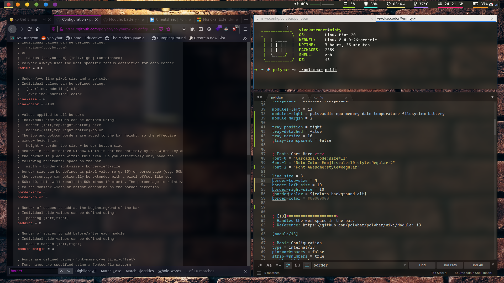

# :snowflake: Dot-Files :rocket:
*These are my dotfiles, none of your dotfiles. :P*

## PolioBar :computer:
- My custom configuration of polybar, i call it `PolioBar`.
- You can find at `polybar/poliobar`.
- Fonts: `FontAwesome`, `Noto Emoji`, `Cascadia Code`
- FontAwesome: `sudo apt install fonts-font-awesome`

### :: Setup :rocket:
- Installing Required Fonts.
    + Installing Cascadia Code Font.
    + `sudo apt install fonts-cascadia-code`
    + Installing Noto Font for emoji support.
    + `sudo apt install fonts-noto`
    + Installing the FontAwesome Font for cool unicode symbols.
    + `sudo apt install fonts-font-awesome`
- Installing Polybar
    + `sudo apt install polybar`
- Installing Network Tray.
    + `sudo apt install nm-tray`
- Setting up the configuration file.
    + Copy the `polybar/poliobar` file to `~/.config/polybar/poliobar`
    + > :warning: NOTE: You can also give it the name of `config` but then you need to modify the `launch.sh` file in `poliobar/`.
- Running the Polybar in `i3` or `i3-gaps`.
    + Copy `polybar/launch.sh` from the repository to  `~/.config/polybar/launch.sh`
    + Give the executable permissions to `launch.sh` by.
    + `chmod +x ~/.config/polybar/launch.sh`
    + Now edit your `i3` or `i3-gaps` config at `~/.config/i3/config`.
    + And add the following line to start the polybar when i3 starts.
    + `exec_always --no-startup-id ~/.config/polybar/launch.sh`
    + Another line to enable the network tray.
    + `exec_always --no-startup-id nm-applet`
    + Then just restart your i3 by <key>mod+shift+r</key>.
    + That's it, you now have a complete functional polybar.

## xorg.conf.d
- Don't know about you but when i was the DE guy, i used to use the gestures of touchpad.
- So i figure out how to enable some gestures for tilling-wm.
### Setup :rocket:
- Setup necessary files.
    + Goto `/etc/X11/xorg.conf.d/`, create if you don't have these folders. 
    + Then create `90-touchpad.conf` and paste the content from my repository's file.
- Thanks to `Cody Craven` check his article here.
- https://cravencode.com/post/essentials/enable-tap-to-click-in-i3wm/

